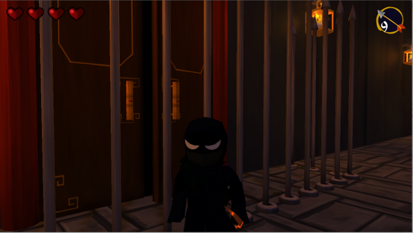

# FruitNinja

Cal Poly CPE 476 - Team Ninja

## Releases

[Version 1.0](https://github.com/jamireh/FruitNinja/releases)

## The Team

 - [Ian Meeder](https://github.com/Blubmin)
 - [Connor Batch](https://github.com/cbatch)
 - [Jon Amireh](https://github.com/jamireh)
 - [Peter Godkin](https://github.com/petegodkin)
 - [Keenan Swafford](https://github.com/freakode)

## Game Concept

When deciding on what game we wanted to make, we first looked at some of our favorite games. We also wanted to make a game that had a consistent feel and so we knew that making a more "cartoony" game would be more feasible than a realistic game. The Legend of Zelda The Wind Waker was a game that quickly came to mind and would eventually become a big influence on the project. A weapon that is pretty quintessential to Zelda games is the bow and arrow and so we decided that we liked the idea of a game whose mechanics centered around the weapon. From a feasibility standpoint, we realized that a heavily offensive game would require complex AI which none of us were quite ready to fully delve into. Another game that our team had enjoyed playing in the past was Splinter Cell. It were here that we decided to make a stealth game. This way we could create AI that didn't have to attack and track the player, but rather only had to detect the player. At its base, we were set on a game: Stealth Bow and Arrow. 

Now we needed an idea for a theme. With the idea of stealth it wasn't long until we decided on the idea that the player's character should be a ninja. But why would he be sneaking around? What would be his motivation? We eventually crafted the idea that he would be trying to steal back a prized possession of his. And because we don't have a single original bones in our bodies, we decided that he was trying to steal back his prized fruit, thus Fruit Ninja. 

During development we kept looking back to the The Wind Waker's stealth level for inspiration. We realized that in order to pull off exactly what we wanted, there needed to be a balance between the bow and the guards that you would be sneaking around from. If the player could just attack and kill every guard, then the game would be too easy. But what would the bow be capable of, then? We decided that light could be part of the game's mechanics and thus in order to hide and sneak around, the player could shoot out lanterns with the bow. After playing a bit, though, we realized that being able to shoot and kill guards a rewarding mechanic that we didn't just want to get rid of. So we made two types of guards - killable ones and unkillable ones. But we still wanted more out of the bow. So again looking at Zelda, we borrowed the idea of shootable buttons. Over time in response to buttons and the like the game morphed and began to also have a lot of platforming elements that we hadn't originally envisioned.

## User Guide

Welcome to Fruit Ninja! In this game you play as Chewy, a ninja aimed to reclaim the sacred pineapple from an unknown enemy. Navigate through 5 different courtyards - sneak around out of the vision of guards (or shooting them with arrows), solve puzzles, avoid traps and reach the door on the other side of the courtyard to advance. During Chewy's adventure you will encounter guards - stay out of their line of sight and don't get too close to them or they will catch you! The hearts in the top left corner of the screen indicate how many lives you have left. If a guard catches you, you lose a life and reset to the beginning of the level. When you run out of lives you will be reset to the beginning of the first level. Being a sneaky ninja, Chewy's weapon of choice is a bow and arrow. The number of arrows that Chewy has is shown at the top right of the screen. Right click to switch to arrow mode, where you can left click to fire your arrows. Use the mouse's scroll wheel to adjust the arc that the arrow will follow when fired, which is shown as a red trail of dots. You can shoot red guards, lights, targets, and a secret object in level 5! Right click again to switch back to the normal camera. If the mouse controls seem off to you, press H to invert the camera controls. You can change the controls back to normal by pressing G. Good luck on your journey!

## Controls

`WASD` - Movement

`RIGHT CLICK` - Toggle Arrow Mode

`LEFT CLICK` - Shoot Arrow (Only in Arrow Mode)

`SCROLL` - Zoom away from Chewy (Player Mode); Adjust Power of Arrow (Arrow Mode)

`SPACE` - JUMP

## Technologies

- Entity Component System
- Octree
- AABB Collision Detection and Response
- View Frustum Culling
- Enemy detection via Raycasting
- 3rd-person Camera Collision
- Deferred Shading
- Rom-Catmull Spline-based Pathing
- Freetype-based & Texture-based HUD
- Textured Modelling
- (Very) Articulated Model Animation
- Directional Shadow Mapping w/ hardware PCF antialiasing
- Billboarded Particle System
- ASCII-based Level Editing
- Model Instancing
- 3D Positional Sound

## Videos

**Level 1**

**Level 2**

**Level 3**

**Level 4**

**Level 5**

## External Libraries

- [Assimp](http://assimp.sourceforge.net/)
- [Freetype](http://assimp.sourceforge.net/)
- [FMOD](http://www.fmod.org/)

## Sources

- [Camera Collision](http://gamasutra.com/blogs/EricUndersander/20131001/201382/Accurate_Collision_Zoom_for_Cameras.php)
- [Plane Corners](http://gamedev.stackexchange.com/questions/19774/determine-corners-of-a-specific-plane-in-the-frustum)
- [Instancing](http://sol.gfxile.net/instancing.html)
- [Rom-Catmull Splining](https://www.cs.csustan.edu/~rsc/CS3600F02/Splines.pdf)
- [Entity Component System](http://gameprogrammingpatterns.com/component.html)
- [Skeletal Animation](http://ogldev.atspace.co.uk/www/tutorial38/tutorial38.html)
- [Deferred Shading](http://ogldev.atspace.co.uk/www/tutorial37/tutorial37.html)
- Shadow Mapping:
  - [http://ogldev.atspace.co.uk/www/tutorial23/tutorial23.html](http://ogldev.atspace.co.uk/www/tutorial23/tutorial23.html)
  - [http://ogldev.atspace.co.uk/www/tutorial24/tutorial24.html](http://ogldev.atspace.co.uk/www/tutorial24/tutorial24.html)
  - [http://www.opengl-tutorial.org/intermediate-tutorials/tutorial-16-shadow-mapping/](http://www.opengl-tutorial.org/intermediate-tutorials/tutorial-16-shadow-mapping/)
  - [http://stackoverflow.com/questions/22419682/glsl-sampler2dshadow-and-shadow2d-clarification](http://stackoverflow.com/questions/22419682/glsl-sampler2dshadow-and-shadow2d-clarification)